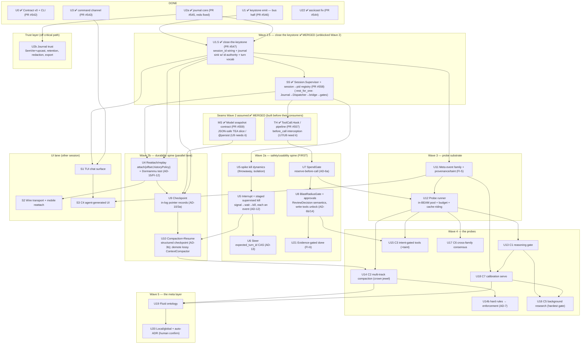

# Harness Roadmap — Autonomous Units Dependency Chart

Date: 2026-07-15 · Status: plan for the agentic-layer + protocol lane (the
"harness-agent" session). UI-lane units appear as external nodes only.
Sources: `harness-spec-protocol.md`, `harness-spec-backend.md`,
`harness-design.md` (C1–C7, control layer, meta layer, economic law),
`harness-synthesis.md` (AD-1..8, FI-1..6, NC-1..5), `harness-baseline-features.md`.

**Unit definition:** independently buildable + shippable (one PR), with its own
acceptance criterion, touching one seam. A unit is "autonomous" when everything
it depends on is merged — at that point it can be built by anyone (including a
subagent) from this doc + the specs alone.

---

## 0. Ground truth (done)

**U0 — Contract v0 + `raxol -p` CLI** ✅ (PR #542)
`Raxol.Agent.Contract` (loop-family envelope, tiers, monotonic ids, JSON codec,
`pump/3`), read-only `Actions.Fs`, `mix raxol.p` + `bin/raxol`. Validated live
against LM Studio with a native tool call. Everything below builds behind the
boundary this established: **producers and features change; the contract only
grows.**

---

## 1. The chart (v3 — post code+plan review)

v2→v3 changes come from the review round (3-model grok plan review + 4 Opus
per-PR code review, all agreeing):

- **Wave 1 shipped as 4 draft PRs** (#543 U3, #544 U22, #545 U2a, #546 U1) but
  U1 shipped only *half* the keystone — the bus, not the journal sink — so a
  **Wave 1.5 "close-the-keystone"** unit is now mandatory before any Wave 2 work.
- **Critical path was backwards.** Unanimous: control plane (interrupt/approvals)
  before continuity (checkpoint/compaction). Checkpointing a loop you can't kill
  = *resumable corruption*. **U5 must precede U10.** Two spines now, safety first.
- **Four missing seams** that Wave 2 units silently assumed are promoted to
  explicit nodes (SS/TH/MS below).



**Two spines, run in parallel after Wave 1.5 + seams land:**
- **Safety/usability (first):** U1.5 → SS → *(U5-spike)* → U5 → U6 · and TH → U7 → U8 → U21
- **Durability:** U1.5 → SS → U4 → U9 → U10 *(U9 also needs MS)*

**Corrected critical path:** U0 → U1 → U2a → **U1.5** → **U5** → U9 → U10 → U14 →
U19 → U20. The change from v2: U5 now sits on the path *before* U9/U10 — you
cannot honestly checkpoint/compact a turn you cannot kill (all three plan
reviewers, verbatim). U14 stays the highest-value node.

**U4 ∥ U9 is a FALSE parallel** (both invent "conversational tip", both extend
journal record kinds) — serialize U4 → U9, or freeze one journal record schema.

**Wave 1 status: DONE.** All 4 PRs merged (#543/#544/#545/#546), rebased onto
the squash-merged #542; U2a's 3 red blockers (single-writer, stale-HEAD
offset, path traversal) were fixed before merge. **Wave 1.5 + the seams are
also DONE**: U1.5 (#547) closed the bus-only keystone + the dual-id landmine
(bridge counter ≠ journal offset); SS (#558), TH (#557), and MS (#559) landed
alongside it. Wave 2 was unblocked as of these merges — see "Red-first
fan-out (2026-07-16)" in §4 for what shipped next.

---

## 2. Unit specs

### Wave 1 — the spine (all three parallel, all unblocked today)

**U1 — Keystone emit** · size M · spec: backend §2
Unify `process_app_update/3` + `process_command_result/2`
(`dispatcher.ex:525-551`, the emits-nothing bug) behind one typed emit →
`SessionStreamer` using Contract events. TimeTravel keeps feeding from the same
seam (one tap, two consumers).
*Accepts:* a TEA `Agent.Session` run produces the same event-trace shape the
CLI produces; async command-result traffic (LLM chunks, shell) emits; the CLI
gains `--session` mode consuming a Dispatcher-resident agent **unchanged** —
that unchanged-CLI property is the proof the contract boundary held.

**U2 — Journal** · size M · spec: protocol §5, backend §4 · **decision D1 inside**
Durable sink subscribed to the streamer: durable-tier events append to a
per-session log; `Event.id` = offset; version tag `{harness_version, model,
config_hash}` on the log head (FI-2).
*Accepts:* kill the BEAM mid-run, reopen, full durable trace readable;
ephemeral deltas provably absent.

**U3 — Command channel** · size S · spec: protocol §4
`%Command{}` structs (`prompt`, `interrupt`; `attach`/`seek` accepted but
stubbed) + decode side of the codec + routing into a session. One validation
seam, loud rejects.
*Accepts:* malformed command → typed error, nothing crashes; `prompt` starts a
turn on a live session.

### Wave 1.5 — close the keystone (BLOCKS all of Wave 2)

Review round (see §3.1) found U1 shipped the bus half of the keystone but not
the journal sink, and left `session_id` unwired (`emit/4` is a no-op while nil,
so nothing is journaled yet). Every Wave 2 unit would pass unit tests on mocks
and fail at integration. Close it first.

**U1.5 — close-the-keystone** · size M · needs U1+U2a (both landed)
(a) Thread `session_id` from `Agent.Session` through `Lifecycle.start_link` into
the Dispatcher state. (b) Wire the durable-tier journal sink behind the same
`emit/4` seam — **and give the journal authority over `Event.id`**: append →
offset → stamp event → publish (kills the dual-id landmine where EmitBridge's
local counter diverges from the journal offset the contract promises). (c)
Minimal loop vocabulary: mint a real `turn_id`, emit `turn_started` /
`turn_completed` / `error` (U5's staged events and U6's `expected_turn_id` CAS
have nothing to hang on otherwise).
*Accepts:* a live `Agent.Session` run writes a durable journal readable after a
BEAM kill; replayed `Event.id` == journal offset == the live tail's ids (one
identity, no divergence); turn brackets present.

**SS — Session.Supervisor + session→pid registry** · size M · needs U1.5
The spec's per-session OTP tree (`:rest_for_one`: Journal → Dispatcher →
bridge → gates), plus a registry mapping `session_id → pid`. Assumed by U4
(resolve a session to attach), U5/U6 (find the turn process to kill/steer), U9
(tag pointer records). Wave 1 left these as manual/ad-hoc wiring; without SS
each Wave 2 unit reinvents it and they collide.
*Accepts:* start/stop a session as one supervised subtree; a crash of the
journal restarts the tree in dependency order; `Registry.lookup(session_id)`
resolves the live dispatcher.

**TH — ToolCall.Hook / pipeline** · size S–M · needs U1.5 · precedes U7/U8
An ordered, registerable `before_call` interception point in the tool-execution
path. U7 (reserve-before-call) and U8 (blast-radius gate) both assume it; today
there's no hookable point, so building U7 first would fuse the seam and its
first consumer into one untestable unit. Build the seam alone first.
*Accepts:* a no-op interceptor observes every tool call with args before
execution; two interceptors run in declared order; one can veto (→ typed error,
call not made).

**MS — Model snapshot contract** · size S–M · needs U1.5 · precedes U9
Declare which slice of a TEA model is durably serializable. Arbitrary models
hold PIDs / Ports / fun-refs / ETS refs / secrets — none JSON-safe. A `@persist`
projection or a `Snapshot` boundary defines the pure, restorable slice.
*Accepts:* a model containing a PID + a secret snapshots to a JSON-safe term
that restores to an equal *persistent* slice; non-persistable fields are
explicitly excluded, not silently mangled; secrets never hit the snapshot.

---

### Wave 2a — safety/usability spine (run FIRST)

**U5-spike — kill dynamics** · ✅ DONE (`harness-research/spike-u5-kill.md`)
Ran clean, twice. Verdict below resolves U5.
- **Kill latency ~2–4 ms** (SIGKILL→gone); the only real cost is the chosen
  grace window.
- **Only OS process-group SIGKILL works.** `kill -9 -<os_pid>` kills clean,
  zero orphans. Both BEAM-native paths **FAILED**: `Port.close` and
  `Process.exit(owner, :kill)` close the port BEAM-side but leave the rogue OS
  process alive >5 s and orphan its grandchild. `kill -9 <pid>` (not group)
  orphans the `sleep` grandchild, which holds the pipe and **suppresses
  `:exit_status`**.
- **Never trust `:exit_status` (or its absence) as the death signal** — a
  surviving grandchild forges "port open". Group-kill, then confirm death at
  the OS level (`ps`).
- Topology: one GenServer opens the Port with `[:exit_status]`, captures
  `os_pid` at spawn (BEAM already makes each port program its own pgroup leader
  — `pgid == os_pid`, no `setsid`, which macOS lacks anyway). No
  DynamicSupervisor / dedicated Port-child needed.

**U5 — Interrupt = staged supervised kill (AD-12)** · **size M (spike-confirmed, do NOT split)** · needs SS+U3
Single GenServer per turn owns the tool Port + its `os_pid`. `interrupt` =
cooperative signal → bounded wait → **group SIGTERM → wait → group SIGKILL**,
confirm OS-level death out-of-band. Each stage its own event; new vocabulary
`turn_canceled{reason}`. Kills a **running shell tool**, not just the loop.
Do NOT couple the kill path to event-bus back-pressure (a slow consumer must
not deadlock the kill). The spike killed the "split into U5a-isolation /
U5b-protocol" idea: BEAM process isolation is exactly what proved *insufficient*
to kill a hostile tool — kill = OS group-kill, one leaf, no seam to split.
Escalate to L only if turns run many concurrent tools or tools double-fork
daemons that escape the group — then add a **reaper**, not a topology split.
*Accepts:* interrupt during a `sleep 30` tool call kills the OS process (group,
confirmed dead) within the grace budget, emits the staged events, session stays
alive for the next prompt, zero orphans.

**U6 — Steer (AD-2)** · size S · needs U5
Distinct message; queued instruction injected at next tool boundary. Never a
flag the loop polls.
*Accepts:* steer mid-turn lands in the next iteration's messages; interrupt
still kills instantly (the two signals stay distinct).

**U7 — SpendGate wiring (AD-6a)** · size S · needs U0
Generalize `Payments.Ledger.try_spend` shape: atomic reserve before every
backend call (tokens/cost), per-run + per-session caps, `CostUpdated`-style
payload on `turn_completed`. Fail-closed.
*Accepts:* cap of N tokens halts the run with a typed error *before* the
over-cap call is made, not after the bill.

**U8 — BlastRadiusGate + approval flow (AD-6b, FI-3/FI-4)** · size L · needs U3+U7
Mutating action classes (fs-write, shell) atomically reserve against a gate
pre-`Port.open`; gate emits `approval_requested{action, blast_radius}` and
blocks on `approval_decision{scope: once/session/root}` (Authorization.Engine
scopes). Shell routes through one wrappable chokepoint (the future kernel-
sandbox seam). Housekeeping code uses the same gate. **This unit unlocks
write-capable tools for the CLI/agents** — until it lands, tools stay read-only
by design, not by accident.
*Accepts:* `raxol -p "delete X"` surfaces an approval on stderr, a piped
`approval_decision` (or `--yolo` flag) resolves it; deny leaves fs untouched.

**U21 — Evidence-gated done (FI-6)** · size S · needs U8
`turn_completed{final: true}` carries verification artifacts (exit codes,
diffs, test output refs) as data. Surfaces can render "done because X".
*Accepts:* a run that executed tools reports their evidence in the final event.

---

### Wave 2b — durability spine (parallel lane to 2a)

**U4 — Reattach/replay** · size M · needs SS+U1.5
`attach{from_offset, historyPolicy}` → replay durable events → subscriber
rebuilds view. CLI: `raxol --attach <session>` prints the past trace then
follows live. Carries the **Dormammu regression test** (FI-12): resume
tip-finding must never select a non-conversational record. Needs a real
durable-fold projection (SessionStreamer history is in-memory and incomplete)
— name it here, don't let attach degenerate into "replay JSON to stdout".
*Accepts:* second CLI process attaches mid-run, sees identical history + live
tail. (Mobile-payoff seam, L2.)

**U9 — Checkpoint (AD-3a)** · size M · needs U4+MS · **serialize after U4**
`{journal_offset, model_snapshot}` as **in-log pointer records** (AD-10); the
snapshot payload is the MS-defined JSON-safe slice, never a raw term dump.
`seek` command drives a read-model to an offset. **U4∥U9 is a false parallel**
(both invent "conversational tip", both add journal record kinds) — U4 lands
the tip rules + record schema first, U9 builds pointers on top. If U7 has
landed, checkpoint must snapshot the ledger reserve consistently (don't
checkpoint mid-reserve — journal and ledger would disagree on resume).
*Accepts:* restore a session from checkpoint; the *persistent* model slice
equals the live one at that offset (not raw term-equality — MS excludes the
non-persistable fields).

**U10 — Compaction = Resume (AD-3b)** · size M · needs U5+U9
One artifact for both: structured checkpoint (task, plan-with-status, touched
artifacts w/ hashes — **a term, not prose**) written at compaction time and on
demand; resume reinjects it verbatim. **Needs U5** — compacting a turn you
can't cleanly stop resumes a lie. **Demote/delete the existing lossy
`ContextCompactor`** as part of this unit, or two continuity models fight.
*Accepts:* a session resumed from checkpoint answers a follow-up correctly
with the raw tail dropped (the #31330 hallucination test, inverted).

### Wave 3 — probe substrate

**U11 — Meta event family + provenance** · size S · needs U0+U2
Contract grows family `:meta` (`gate_decision`, `extract`, `residual`,
`calibrate`, `verdict`, `research`, `promote`) + `provenance{source, trust}`
on every event (FI-5 taint marker). Journal carries both populations.
*Accepts:* codec round-trips meta events; a tainted tool result propagates
`trust: :tainted` to derived events.

**U12 — Probe runner** · size L · needs U11+U7 · **decision D2 inside**
Supervised background probe execution: concurrency caps, per-probe budget via
SpendGate, non-LLM termination (timeout + max-calls), **cache-riding** — probe
requests share the primary conversation prefix so LM Studio's KV-cache /
Anthropic's prompt-cache make them near-free (the economic law, mechanical).
Probes emit only meta events; **injection into primary context is a separate,
explicit step** (discipline at the injection boundary, not generation).
*Accepts:* N dummy probes run per turn without extending turn latency;
killing one never touches the primary loop; budget exhaustion parks probes.

### Wave 4 — the probes (all need U12; parallel)

**U23 — eval harness** · size M · needs U4+U11 · **gates all of Wave 4**
(ratified 2026-07-16; `harness-eval-first-analysis.md` §4.1). Journal-replay
model-behavior eval: measures probe **signal quality** (C1 score↔benefit
correlation, compaction fidelity across a model swap) against a **null baseline**.
Infra is ~80% already built and merely unnamed — the journal replay closure
(U4 / P-JS5) plus the FI-2 log-head version tags
(`{harness_version, model, config_hash}`) are exactly the substrate a replay-eval
needs. **This unit gates Wave 4:** no probe (U13–U18) graduates without it.
*(Numbering note: V's ruling proposed "U22" for this unit, but U22 is the
already-landed asciicast fix (PR #544) — the eval unit is **U23** to avoid
renumbering an existing unit.)*
*Accepts:* a probe run over a replayed journal produces a score the harness can
compare to the null baseline; a probe that does not beat the null baseline is
rejected by the acceptance bar; the C1 A/B (U13) runs as an exit criterion.

**Probe-unit requirement (ratified 2026-07-16):** every probe unit (U13–U18)
carries a one-line **sunset** annotation in its spec ("delete when
provider-native X matches on eval") — frozen as an OPTIONAL `spec()` field in
`harness-freeze-contracts.md` §3, REQUIRED for Wave-4 graduation. Grandfathered
C-probes gain their sunset line at next touch. Probe **acceptance** requires
beating the null baseline on U23's eval set.

**U13 — C1 reasoning gate** · size M
Pre-query probe scores reasoning-benefit 0–100 (structured output, regex
fallback); `<30` skip / `30–70` seeded dice / `70+` reason. Seed journaled
(`gate_decision{seed}`) for replay. Recognition-framed prompt.
*Accepts:* trivial prompt skips thinking, hard prompt engages it; replaying
the journal reproduces the same dice outcome.

**U14 — C2 multi-track compaction** · size L · needs U12+U10 · **crown jewel**
Three typed extraction tracks per result (when→then rules / session memory
add-update-drop / worktracks kanban) + the 4th **residual** track, each a
journal projection. At 75% context: per-class "what's missing" pass + fresh
session seeded from projections instead of prose summary.
*Accepts:* a long multi-tool session crosses the 75% swap and the successor
session honors a constraint stated early in the original (the OpenClaw test).
*Exit criterion (control arm, ratified 2026-07-16):* C2 is measured against
Anthropic-native compaction (`compact-2026-01-12` + memory tool) **over the same
corpus** on the U23 eval harness. If native compaction wins, **C2 demotes to an
adapter** over the provider primitive rather than a from-scratch crown jewel.
This closes the "C2 never argued against provider-native compaction" echo — see
`harness-eval-first-analysis.md` §4.3.

**U14b — Hard rules → enforcement (AD-7)** · size M · needs U14
Extracted `when tool=X then deny/ask` rules feed `Authorization.Engine` /
`ToolPolicy` as live policy; soft guidance stays as reminders. Extraction-to-
executable-policy — the difference between the OpenClaw incident happening
and not.
*Accepts:* a rule extracted mid-session ("never touch prod db") blocks the
matching tool call after compaction, structurally.

**U15 — C3 intent-gated tools** · size M · needs U12+U8
Agent states intent + wanted fields; a non-reasoning pass filters tool output
to that shape before it enters primary context; raw output journaled +
tainted; "give me raw" escape hatch.
*Accepts:* a 50KB tool result reaches primary context as the ≤2KB intent
slice; the raw remains retrievable from the journal.

**U16 — C5 background research** · size M · needs U13+U18 (gated hardest)
Recognition-framed trigger ("signs of known incompleteness classes?" — may
return empty), budgeted background session, conclusion lands as ignorable
suggestion event, never an interrupt.
*Accepts:* trigger fires <30% of turns on a normal session (calibrated by
U18); runaway impossible (hard call-count cap).

**U17 — C6 cross-family consensus** · size M · needs U12
Opt-in; leader + ≥1 independent family (we have anthropic + lm_studio today);
self-drift recognition probe as cheap pre-gate; verdicts emitted as
`verdict{family, drift_score, advice}` — advisory channel only, never
raw-appended to primary.
*Accepts:* with two families configured, a deliberately-drifted run gets
flagged by the other family; single-family config degrades to pre-gate only.

**U18 — C7 calibration servo** · size M · needs U11+U13
Rank-based: track each gate's score distribution, set thresholds at the
quantile matching a human setpoint rate; variance-floor guard (saturation ≠
miscalibration), damping + hysteresis. First client: U13's 30/70 thresholds.
*Accepts:* feed a synthetic inflated-score stream → threshold rides up to
hold the setpoint rate; a zero-variance stream trips the floor guard.

### Wave 5 — the meta layer

**U19 — Fluid ontology** · size M · needs U14+U18
Residual recurrence promotes new extraction classes (recur-N); empty-M
demotes. Meta-budget caps ontology churn per unit of real work. Convergence
guards mandatory (hysteresis + damping — the one loop that can run away while
looking like learning).
*Accepts:* a synthetic session stream with a recurring residual theme gets a
promoted class within N occurrences and stops churning after.

**U20 — Local/global + auto-ADR** · size M · needs U19
Classifier probe tags extractions session-local vs project-global; global
promotion auto-drafts an ADR with journal-provenance links and **blocks on
human confirm** (`promote` → `approval_decision`) — the one irreversibility
boundary with a mandatory human beat.
*Accepts:* a project-shaped decision surfaces as a draft ADR with correct
event links; nothing lands in the global store without the confirm.

---

## 3. Decisions embedded in units

### 3.1 Review round (after Wave 1 landed)

Wave 1 shipped as 4 draft PRs, then a review round: a 3-model grok plan review
(grok-4.5 + grok-composer-2.5 + longcat, all three independent) on Wave 2
sequencing, plus 4 Opus per-PR code reviews. Findings that reshaped the chart:

- **Critical path was backwards — unanimous across all three plan reviewers.**
  Control plane (interrupt/approvals) must precede continuity (checkpoint/
  compaction). Checkpointing a loop you can't kill = *resumable corruption*.
  **U5 before U10.** → two-spine reorder (safety-first) + U5 pulled onto the
  critical path. longcat: *"the control plane IS the product."*
- **U1 shipped half a keystone.** The bus half landed (PR #546); the journal
  sink (deferred item d) did not, and `session_id` is unwired (`emit/4` no-ops
  while nil). → **Wave 1.5 (U1.5)** is mandatory before any Wave 2 unit.
- **Dual-id landmine** — found *independently* by grok-4.5 (plan) and the U1
  Opus code review: EmitBridge stamps `Event.id` from a local counter, but the
  contract says `id = journal offset`; they diverge the moment the sink lands.
  → U1.5 gives the journal authority over id (append→offset→stamp→publish).
- **Four assumed-but-unbuilt seams** promoted to nodes: **SS** (Session.Supervisor
  + session→pid registry), **TH** (tool-call `before_call` hook, precedes U7/U8),
  **MS** (model-snapshot serialization contract, precedes U9). Without them each
  Wave 2 unit reinvents wiring and they collide.
- **U5 = highest-risk unit (unanimous), not U10.** → **U5-spike** ran (isolation,
  throwaway) and **resolved it**: kill = OS process-group SIGKILL (BEAM-native
  Port.close/Process.exit proved *insufficient*), ~2–4 ms latency, never trust
  `:exit_status` as death. U5 stays **size M, no split** — the reviewers'
  process-per-tool-isolation assumption was the very approach the spike
  disproved. See `spike-u5-kill.md`.
- **U4 ∥ U9 is a false parallel** — serialize U4 → U9.
- **Forced-serial chains:** U5→U6 (same turn/tool seam), U7→U8 (same tool gate),
  U4→U9→U10 (journal record schema). **Safe parallel after Wave 1.5+seams:**
  {U5-then-U6} ∥ {U4-then-U9-then-U10} ∥ {U7-then-U8}.

**All four merged to master** (#543/#544/#545/#546), each rebased onto the
squash-merged #542. Per-PR code verdicts, all remediated before merge: U1 #546
pass (2🟡: dual-id + payload-shape — deferred to U1.5, which owns them). U2a #545
had **3🔴 — fixed** (single-writer via `:global` name, stale-HEAD resume via
`max(head, Reader.last_offset)`, path traversal via session_id validation) + 4🟡
incl. torn-vs-corrupt split; 18 journal tests, suite 938 green. U3 #543 clean
(2🟡). U22 #544 **4🟡 fixed** (same torn-vs-corrupt split, O(1) append, rescue
narrowed, single-writer documented); 24 tests. Cross-cutting: U2a and U22
reviewers independently caught the torn-vs-flushed-corrupt conflation.

`:global` for the single-writer name is a v0 expedient (test env doesn't boot
the app tree, so no Registry exists); revisit when **SS** lands and the session
tree boots — a per-session Registry is the cleaner home.

### 3.2 Round-2 cohort research

Round-2 cohort research (`harness-storage-research.md`, briefs 10–15) resolved
most of these; dispositions AD-9..15 / FI-7..12 / NC-6..8 bind the units:

- **D1 (U2) — RESOLVED: framed JSONL append-only files** with Ra/Rabbit WAL
  discipline (torn-tail truncate, interior-corruption alarm, batched datasync
  ≤200ms + immediate on side-effect events, capped segments, derived-only
  indexes). SQLite/DETS/Mnesia/CubDB all eliminated on evidence (NC-6/NC-7).
  Schema SemVer'd independently of app version, upcast-on-read (AD-11).
  Plus FI-7 (never delete silently), FI-9 (validate-on-replay — journal
  integrity is context integrity), FI-10 (no content telemetry; redact
  secrets at write boundary), FI-11 (disk-full defined).
- **D2 (U12) — scheduler:** in-BEAM supervised pool stands (D1 stayed on
  files, so Oban's Postgres never enters).
- **D3 (U8) — PARTIALLY RESOLVED:** approval payloads adopt Codex
  `ReviewDecision` semantics — `Denied` ≠ `Abort`, `TimedOut` first-class,
  decision-carries-policy-amendment (AD-14). Headless transport remains:
  policy flags + deny-by-default v0; interactive arrives with S1.

Unit-spec deltas from round 2:
- **U4** adopts `attach{from_offset, historyPolicy}` + broadcast permission
  bus (AD-15); gains the **Dormammu regression test** (FI-12) — resume
  tip-finding must never select a non-conversational record.
- **U5** becomes staged escalation, each stage an event: cooperative signal →
  bounded wait → supervised kill (AD-12). The kill is our OTP differentiator
  (nobody in the cohort has kill-now); the staging is the cohort's convergent
  pattern.
- **U6** steer carries `expected_turn_id` CAS + non-steerable turn kinds
  (AD-13).
- **U9** checkpoints are **in-log pointer records** (all four leaders
  independently reinvented this) + sidecar holds HEAD/config only, never
  model state (AD-10, OpenHands).
- **Backlog (not a unit):** `recording/asciicast.ex` fails round-2 disciplines
  (whole-session buffered write, no torn-tail read tolerance) — fix
  separately; do not reuse its writer for the journal.

## 4. Sequencing reality

- **Done:** U0 (#542), U1 (#546), U2a (#545, reds fixed), U3 (#543), U22
  (#544) — Wave 1. U1.5 (#547), SS (#558), TH (#557), MS (#559) — Wave 1.5 +
  seams. All merged to master.
- **Then two spines in parallel:**
  - safety/usability: (U5-spike, done) → U5 → U6 · and TH → U7 → U8 → U21
  - durability: U4 → U9 → U10 (U9 also needs MS; U10 also needs U5)
- **Corrected one-person critical path:** U0 → U1 → U2a → U1.5 → U5 → U9 → U10 →
  U11 → U12 → U14 → U14b → U18 → U19 → U20 — U5 now precedes U9/U10 (can't
  checkpoint what you can't kill); U7/U8 land before any write tool ships.
- **Contract governance:** vocabulary only ever *grows* (U5 adds
  `turn_canceled`, U11 adds the meta family); no breaking renames — surfaces
  from the UI lane must never need lockstep updates.
- **NC guards still binding:** no graph/DSL (NC-1), no swarm headline (NC-2),
  no ACP server (NC-3), no Temporal-grade engine (NC-4).
- **Packaging ratification (pre-CLI-surface, ratified 2026-07-16):** decide
  **burrito vs `mix release`** (self-contained binary vs BEAM-runtime dep) and
  write a **decision doc** *before* the CLI surface ships. The cohort's Codex
  lesson is a zero-dependency binary; we carry a BEAM runtime dep and have no
  packaging answer yet (blind spot #2, `harness-eval-first-analysis.md` §4.4).
  Not a numbered unit — a gate on the S1/S2 CLI-surface lane.

### Red-first fan-out (2026-07-16)

With Wave 1.5 + seams merged, all 10 Wave 2/3 units shipped their **red
suite** first as individual PRs, rather than waiting for a combined
implementation PR per unit. Each PR is enabler-plus-red: it builds whatever
scaffolding the tests need to compile, then a red test suite carrying
positive *and* negative contours (dead-injector negative controls proving
each red would actually fail if the invariant were violated), tagged
`@moduletag :harness_red`. These suites are CI-green *by construction* (the
enabler makes them pass trivially or the suite documents expected-red state)
until the real implementation lands — they are not yet proof the unit works,
only proof the contract is pinned down precisely enough to implement against.

| Unit | PR | Title |
|---|---|---|
| U21-R | #570 | Evidence-gated done (FI-6) |
| U7-R | #571 | SpendGate reserve-before-call (AD-6a) |
| U5-R | #572 | Interrupt = staged supervised kill (AD-12) |
| U6-R | #573 | Steer via `expected_turn_id` CAS (AD-13) |
| U10-R | #581 | Compaction = resume, one artifact (AD-3b) |
| U9-R | #582 | Checkpoint pointer records (AD-10/3a) |
| U12-R | #583 | Probe runner interface (D2) |
| U11-R | #584 | Meta family + provenance/taint (FI-5) |
| U4-R | #586 | Reattach/replay closure + Dormammu (AD-15/FI-12) |
| U8-R | #587 | BlastRadiusGate + approvals (AD-6b/14) |

**Impl phase is next:** make the merged reds green, down the critical path
**U5-I → U7-I → U4-I → U9-I** (safety spine first, then durability spine,
matching §1's two-spine ordering). U6-I/U8-I/U21-I/U10-I/U11-I/U12-I follow
per their existing `needs` edges in §1's chart.

Several contract gaps and policy questions surfaced during this fan-out that
don't block the red suites themselves but do block their respective impl
units — see `harness-parked.md` for the full tracked list (restore-path
hardening, per-unit freeze addenda, the U21 gating-strength ruling, wiring
debt, and deferred test tags).
```
