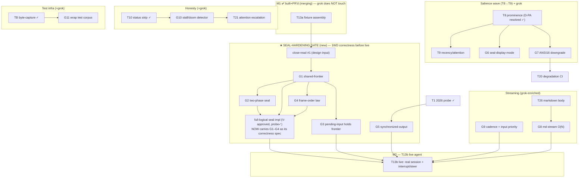

# Harness UI — DAG reshape after the grok-build harvest (2026-07-16)

Companion to `harness-ui-roadmap.md` (the base DAG) and
`grok-build-design-parallels.md` (the findings). This reshapes *remaining* work
only — everything through T13a (M1) is built + PR'd and merging; the harvest
doesn't touch it.

## The reshape principle (why the DAG barely moves in shape but sharply in weight)

The grok findings land on exactly two clusters of the existing DAG:
1. **the seal substrate** (T2a/T2b/T2c — already built), and
2. **live streaming** (T13b, T26).

They do NOT touch nav (T14-T16), honesty-nav (T17-T19), or panels (T22-T23).
So the DAG's *topology* is stable. What changes is **weight + a new gate**:

> Between M1 (T13a, fixture) and M2 (T13b, live) we now insert an explicit
> **Seal-Hardening Gate (SHG)** — the one-way-door correctness items grok paid
> for that must be right *before* live traffic and *before* the full-logical
> seal rework. The pending full-logical-seal impl stops being "a feature" and
> becomes "the vehicle that carries the SHG items."

Close-read task #1 feeds the SHG; it is the SHG's design input, not a parallel
chore.

---

## Grok-derived units (the injection set)

`amends` = folds into an already-built unit as a hardening follow-up.
`1WD` = one-way door (get it right before live traffic / before it's in sealed bytes).

| id | what | kind | deps | gates | 1WD |
|----|------|------|------|-------|-----|
| **G1 shared-frontier** | ONE pure `seal_frontier/2` predicate consumed by sealer + footer-sizer + keyframe/reflow gate + tail renderer (§1) | amends T2b/T2c | close-read #1 | full-logical seal, T13b | ✔ |
| **G2 two-phase seal** | seal = write→confirm→mark; append-only after; no post-seal in-place fill — fill paths check `sealed?` and emit fresh (§3) | amends T2b | G1 | full-logical seal, T13b | ✔ |
| **G3 pending-input holds frontier** | seal predicate first clause `not awaiting_human_input`, unconditional on turn state (§2) | amends G1 | G1 | T13b (live approvals) | ✔ |
| **G4 frame-order law** | adopt-resize-FIRST; size footer to POST-seal height; then seal; then repaint (§5) | amends T2c + T13a assembler | G1 | T13b | ✔ |
| **G5 synchronized-output** | wrap seal-batch + footer repaint in `\e[?2026h…l`; reuse T1's 2026 probe (§6) | new (on T1) | T1 ✓ | T13b (flicker) | — |
| **G6 seal-display-mode** | `seal_display_mode/1` per block-kind, frozen at seal, distinct from interactive fold (§4) | amends T8/T9 | T8 | — | ✔ (per-seal) |
| **G7 ANSI16 salience downgrade** | role-named colors; 16-color downgrade preserves category/polarity not nearest-RGB; audit gray-collapse count (§K) | amends T8 + salience-color-model | T8 | T20 snapshots | — |
| **G8 md-stream O(N²)→O(N)** | stable-prefix freeze at depth-0 boundaries; re-render tail only; width-keyed wrap cache (§G) | amends T26 | T26 | T13b (md latency) | — |
| **G9 stream cadence + input priority** | ~16ms coalescing flush GenServer; bounded per-frame drain; input events scheduled ahead of token flush (§F) | new (T13b infra) | — | T13b smoothness | — |
| **G10 stall/doom-loop detector** | independent resample/attention budget vs error-retries; surface-to-human on visible loop, never auto-recover visible output (§H) | new honesty unit | T10 (working-vs-hung) | — | — |
| **G11 wrap test corpus** | port grok's `segment.rs` cases (trailing-ANSI-on-full-line, char-wider-than-term, bare-CR, zero-width-merge) as TextMeasure/TB spec (§E) | amends TB / TextMeasure | — | (hardens TB) | — |

---

## Reshaped DAG overlay (remaining work only)



---

## Reshaped critical path

**Before harvest:** `… T13a (M1) → T13b (M2)` with T13b gated only by agent-lane
deps (U1.5/SS/U5/U6).

**After harvest:**
```
T13a (M1, merging)
  → close-read #1
  → G1 shared-frontier
  → { G2 two-phase, G3 pending-input, G4 frame-order }   (fan out from G1)
  → full-logical seal impl  (carries G1/G2/G4)
  → T13b (M2)   [also needs G5, G9, and agent-lane U1.5/U5/U6]
```
The SHG **lengthens the M1→M2 path deliberately** — but every SHG item is a 1WD
that is cheaper now (fixture-testable, no live traffic) than after T13b ships
corrupt sealed bytes to a real terminal. This is red-first applied to the
substrate: pay the correctness tax before the path that can't be undone.

Off the critical path (parallel, anytime):
- **G11 wrap corpus** — zero deps, hardens TB. Do first / cheapest.
- **G7 ANSI16 + G6 seal-mode** — ride the T8→T9 salience wave.
- **G8 md-stream** — rides T26, independent of SHG.
- **G10 stall detector** — rides T10 (already shipped), independent honesty unit.

---

## Priority re-weighting (what changed)

| item | was | now | why |
|------|-----|-----|-----|
| full-logical seal impl | "next big feature" | **SHG vehicle, gated on close-read #1** | grok gave it a correctness spec (G1/G2/G4); doing it without them ships 1WD bugs |
| G11 wrap corpus | — | **do first (cheap, zero-dep, hardens oracle)** | ready-made spec, de-risks every wrap path |
| G5 sync-output | — | small, T1 probe already exists | flicker + protects sealed bytes on resize |
| G10 stall detector | latent (T21 area) | **promoted — we're a supervision instrument** | grok's clearest agent-supervision fit; T10 already ships working-vs-hung |
| T13b | "just needs agent lane" | **also needs SHG + G9** | live traffic is where 1WD seal bugs bite |
| §7 resize ruling | open | **HELD (V ruling) — park, rework later if needed** | — |

---

## Concrete next moves (in order)

1. **G11 wrap corpus** — cheapest, zero-dep; port grok `segment.rs` cases into
   TextMeasure/TB test suite. De-risks all wrap-dependent seal paths. Can spawn
   a builder now (independent of PR cascade).
2. **close-read #1** — read commit.rs:219-1324 (commit_active retry loop + unit
   suite), overlay sync_viewport, then bank G1-G4 as the full-logical-seal spec.
3. **G1 shared-frontier refactor** — extract the single `seal_frontier/2`; make
   sealer + footer-sizer + keyframe gate consume it. Red-first: a test that the
   three consumers agree at a resize boundary.
4. Then **G2/G3/G4** off G1, then **full-logical seal impl** carrying them.
5. Parallel salience wave: **T8 → {G6, G7} → T9**.
6. Parallel: **G10 stall detector** (rides shipped T10), **G8** (rides T26).

All of this stays behind the current PR cascade for merge — SHG units are new
branches off master once the T2-spine lands. Nothing here jumps the merge queue.
```
