# Harness UI Roadmap — Atomic Units DAG (the TUI lane)

Date: 2026-07-15 · Status: **v2 — post triad review**. Counterpart to
`harness-roadmap.md` (agent lane); its S1/S2/S3 external nodes expand here.
Sources: `harness-ui-cohort-research.md` (AD-U1..7, FI-U1..5, NC-U1..4),
`harness-ui-north-star.md`, `harness-spec-frontend.md`, `tui-steal-list.md`,
`f0-capability-detection.md`.

v1→v2 changes come from a 3-model adversarial review (grok-4.5 /
grok-composer-2.5-fast / longcat, independent runs; raw outputs in
`harness-ui-research/triad-*.md`). Unanimous findings that reshaped the chart:

- **T2b is the highest-risk unit and was missing from T13's deps** — the
  stated critical path (T0→T2a→T2c→T13) hid the append-path spine. Fixed.
- **Seal-once history contradicts salience/fold/flash/divider/resize** — a
  "paint authority" decision (D-PA) now gates the whole T2/T4/T8 complex.
- **T13 could go green while broken** — its acceptance needed U5/U6 (real
  interrupt/steer) and T5; split into fixture-S1 and live-S1.
- **Capability claims were overstated**: mode-2026 support today is env-sniff
  (`advanced_features.ex` `query_synchronized_output_support/0` returns a
  hardcoded false / TERM_PROGRAM sniffing); **no DECRQM reply parser exists**;
  T1 repriced.
- **The current driver is alt-screen-first** (`\e[?1049h` at init) and no unit
  migrated it — new unit T2d "inline driver profile."
- **T2a kill-9 acceptance was untestable** (SIGKILL runs no cleanup) — rewritten.
- **T0 repriced S→M, throwaway→keystone prototype** with a binding verdict.
- tmux is a primary deployment with three independent breakage modes (OSC 133
  not forwarded; DECRQM passthrough off by default ≥3.3a; nested regions) —
  owned explicitly in T0/T1/T3/T6.
- New units: T24 (AD-U6 full-screen diff expand — was a promise with no
  deliverer), T25 ($EDITOR suspend/resume job control), T26 (markdown body).
- T20 decoupled from T5 so degradation CI lands early; T23 gained its U11 edge.

**Unit definition** (same as agent lane): independently buildable + shippable
(one PR), own acceptance criterion, one seam. Sizes S/M/L. Execution follows
`harness-ui-methodology.md` (changeset-fusion; hold-until-merge PRs; STATE doc).

The shape being built: **fish, not htop** — inline scrollback-native stream of
semantic blocks + one pinned strip (composer/status) + summonable overlays +
salience-graded prominence. Alt-screen never as the app shape (NC-U1);
decoration never (NC-U2).

---

## 0. D-PA — the paint-authority decision (gates everything)

*What may be rewritten after a block is sealed into scrollback?* Three options:

- **(A) seal-time-only** — prominence/fold state frozen at seal; salience and
  fold apply only to the live region; jump-flash/divider are approximations.
- **(B) soft-owned history** — a bounded cache of recent blocks may be
  re-emitted under strict rules (2026-framed, bounded depth); older history is
  terminal-owned and frozen.
- **(C) live-region-only salience** — north-star §3.2 narrowed to the viewport.

Resize interacts: a block sealed at width 80 is permanently mis-wrapped at 120
unless (B)-style re-emission exists for the visible tail. **D-PA is decided in
T0's verdict doc, from measured terminal behavior, and binds T2b, T4 (fold),
T8/T9 (salience), T15 (flash), T17 (divider).** Until D-PA lands, none of
those units may be committed (built against fixtures = fine).

### D-PA PROVISIONAL DEFAULT (Fable ruling, 2026-07-16, per the alignment audit)

Ring B (the real-terminal measurement that produces the D-PA verdict) is an
unscheduled human action that has become the sole gate on the serial critical
path (T2a→T2b→T2c→T13a). To stop the human-availability risk from stalling the
substrate spine: **if ≥2 real tier-1 C-2 rows have not landed by the time the
last W1 fix-loop closes, [F] issues provisional D-PA = (A) seal-time-only** and
T2a starts against it. Rationale: (A) is the most conservative policy; every
built unit already survives it (T2b's suite is explicitly parameterized over
A/B/C, salience/fold degrade to live-region-only). (B) is then a purely
**additive** upgrade if Ring B later permits — contract-only-grows works in
that direction; the reverse (starting on B and retracting to A) does not.

The audit-quantified exposure of a worst-case Ring B ("flat mode primary"):
**zero** built changesets are invalidated (all of TB/TP/TF/TE/T1/T4/T7/T26/
T11/T27/T28a/T2d survive; T8/T14 take ~10–20% scope-narrowing). The cost is
strategic — salience shrinks to viewport-only, moat → "honest stream + strip."
The code is safe; the differentiated-moat *thesis* is what Ring B validates.

### D-PA RESOLVED — measured on real hardware (RB automated matrix, 2026-07-16)

Ring B ran as an autotest (unit RB) driving real terminals via device control.
Result: **worst-case is OFF the table, and (B) is physically real on ≥1 tier-1.**
- **C-2 scrollback-feed = FED on iTerm2 + wezterm + kitty** (all 3 automatable
  tier-1), 100/100. The inline-hybrid substrate is confirmed viable — "flat
  primary" is dead.
- **C-4 resize: iTerm2 REFLOWS sealed history cleanly** (the (B) signal). Only
  iTerm2 was resize-testable (wezterm/kitty expose no cell-resize API), so (B)
  has ONE tier-1 confirmation, not the ≥2 the strict gate wants.
- **N06: `\e[2J` wipes scrollback on wezterm/kitty** (iTerm2 preserves) —
  VALIDATES T2c's inline-mode keyframe-ban as load-bearing, not paranoid.
- Resolver: provisional (A), go partial; ghostty structurally un-measurable
  (no get-text API), so a fully-definitive automated verdict is impossible.

**RULING (Fable): ship D-PA = (A) seal-time-only, with (B) as a RUNTIME-DETECTED
additive upgrade.** (A) is the shipping default (every unit survives it; can't
confirm reflow on ≥2 tier-1). But iTerm2 proves (B) is real — so T2b detects
reflow-capability per-terminal (RB's C-4 probe becomes a startup capability
check) and upgrades that session to soft-owned-history (B) where the terminal
reflows. Contract-only-grows: A-default, B-where-earned. The audit's #1 risk
is RETIRED — moat validated on real hardware, not deferred to a human runbook.

---

## 1. The DAG

```mermaid
flowchart TB
    subgraph EXT["external deps"]
        U0ext["U0 ✅ Contract v0"]
        U3ext["U3 ✅ command channel"]
        U1_5ext["U1.5 close-the-keystone (agent lane, in flight)"]
        SSext["SS Session.Supervisor (agent lane)"]
        U5ext["U5 interrupt=staged kill (agent lane)"]
        U6ext["U6 steer (agent lane)"]
        U4ext["U4 reattach/replay (agent lane)"]
        U21ext["U21 evidence-gated done (agent lane)"]
        U11ext["U11 meta events (agent lane)"]
        U14ext["U14 C2 projections (agent lane)"]
        PRext["harness component PRs #535–541 (built, unmerged)"]
    end

    subgraph TINFRA["Test infrastructure (units in their own right)"]
        TB["TB byte-capture harness (S–M)<br/>CaptureAuthority + SequenceScanner ext + Emulator replay oracle"]
        TP["TP pty harness (S)<br/>pty_spawn wrapper, signal delivery, post-mortem stty"]
        TF["TF fixture toolchain (M)<br/>JSONL schema + decode shim + bless task + 6 golden sessions"]
        TE["TE emulator scrollback-feed fix (S–M, OPTIONAL)<br/>upgrades emu from byte-oracle to scrollback-oracle"]
    end

    subgraph FOUND["Foundation — render substrate"]
        T0["T0 keystone prototype: inline hybrid matrix (M)<br/>verdict binds D-PA + driver profile + fallback triggers"]
        T1["T1 capability slice (M)<br/>DECRQM parser + 2026 probe + tmux clamp + quirks"]
        T2d["T2d inline driver profile (M)<br/>no 1049h, raw IO path, teardown incl. CSI r"]
        T2a["T2a scroll-region manager (S)<br/>region = TOP history rows, footer outside"]
        T2b["T2b printed-history append path (L)<br/>second emit vocabulary, cursor protocol w/ T2c"]
        T2c["T2c pinned viewport (M)<br/>no e[2J keyframes; resize w/o history wipe"]
        T3["T3 degradation ladder (S)<br/>inline_log | tmux-conservative | flat"]
    end

    subgraph BLOCKS["Foundation — block model"]
        T4["T4 HarnessBlock core (M)"]
        T5["T5 block bodies mounted (S–M)"]
        T6["T6 OSC 133+777 marks (S)"]
        T7["T7 journal-fold projection (M, fixtures)"]
        T26["T26 markdown message body (M)"]
    end

    subgraph SAL["Foundation — salience"]
        T8["T8 prominence attr (M, D-PA-gated)"]
        T9["T9 recency/attention policy (S–M)"]
    end

    subgraph CHROME["Construction — chrome"]
        T10["T10 status strip (S)<br/>+ working-vs-hung elapsed"]
        T11["T11 composer (M)"]
        T25["T25 $EDITOR suspend/resume (S–M)"]
        T12["T12 keybinds (S)"]
        T13a["T13a S1-fixture assembly (M)<br/>replayed session, full chrome"]
        T13b["T13b S1-live (M)<br/>real session + real interrupt/steer"]
    end

    subgraph NAV["Construction — navigation"]
        T14["T14 overlay picker primitive (M)<br/>substrate per D-PA"]
        T15["T15 palette + jump + session picker (S–M)"]
        T16["T16 transcript search (M)"]
        T24["T24 full-screen diff expand (M)<br/>AD-U6 layout mechanism"]
    end

    subgraph HONEST["Construction — honesty"]
        T17["T17 unread divider (S)"]
        T18["T18 restoration diff on reattach (M)"]
        T19["T19 evidence-rendered done (S)"]
        T20["T20 degradation CI snapshots (S–M)"]
        T21["T21 attention escalation (S)"]
    end

    subgraph PANEL["Construction — instruments (last)"]
        T22["T22 projection panels (M)"]
        T23["T23 C4 agent-generated panels (M)"]
    end

    TB --> T2b
    TB --> T2c
    TP --> T2d
    TP --> T2a
    TP --> T25
    TF --> T7
    TF --> T26
    TF --> T13a
    TE -.-> TB
    T0 --> T2d
    T0 --> T2a
    T1 --> T2a
    T2d --> T2a
    T2a --> T2b
    T2a --> T2c
    T2b --> T2c
    T2b --> T3
    T2b --> T6
    T4 --> T5
    PRext --> T5
    T4 --> T6
    T4 --> T7
    T4 --> T26
    U0ext --> T7
    T0 --> T8
    T8 --> T9
    T7 --> T9
    T7 --> T10
    T2b --> T13a
    T2c --> T13a
    T3 --> T13a
    T5 --> T13a
    T7 --> T13a
    T10 --> T13a
    T11 --> T13a
    T12 --> T13a
    T11 --> T25
    T11 --> T12
    U3ext --> T12
    T13a --> T13b
    U1_5ext --> T13b
    SSext --> T13b
    U5ext --> T13b
    U6ext --> T13b
    T0 --> T14
    T14 --> T15
    T4 --> T15
    T7 --> T16
    T14 --> T16
    T5 --> T24
    T2c --> T24
    T7 --> T17
    U4ext --> T18
    T7 --> T18
    U21ext --> T19
    T4 --> T19
    T3 --> T20
    T10 --> T20
    T13b --> T21
    T14 --> T22
    U14ext --> T22
    U11ext --> T23
    T22 --> T23
```

**Unblocked TODAY (no deps):** T0, T1, T4, T11 **+ TB, TP, TF** (test infra
has zero deps and must finish before its consumers start) — plus T26 after
T4. TE optional, anytime. T8 and T14 start as fixture/buffer-mode components
but **commit only after T0's D-PA verdict** (their substrate assumptions are
what D-PA decides).
**Critical path:** T0 → T2d → T2a → **T2b** → {T2c, T3} → T13a → T13b; block
spine T4 → T7 → T13a parallel. TB/TP/TF sit beside T0 on the frontier — they
don't lengthen the path (short units, parallel to the keystone) but T2b/T2d
must not START before TB/TP exist (suite-first discipline).
**Agent-lane touch points:** T13b ← U1.5+SS+U5+U6 · T18 ← U4 · T19 ← U21 ·
T22 ← U14 · T23 ← U11. Everything up to and including T13a runs on fixtures.

---

## 2. Unit specs

### Test infrastructure (build first — consumers must not start without them)

**TB — byte-capture harness** · S–M · no deps
`PaintAuthority` behaviour + `CaptureAuthority` (origin-tagged `%Emit{}`
records) + `SequenceScanner` positional extension (region top, cursor row,
`\e[2J` detect, save/restore balance) + `AnsiReplayer`/Emulator replay
wrapper with the `history/1` accessor. Includes the **oracle self-test**
(R-P12): the oracle must flag a known-bad byte stream before any of its
passes are trusted.
*Accepts:* a hand-written violating stream is caught by both oracles; a
known-good stream passes; origin tags survive interleaving.

**TP — pty harness** · S · no deps
Vendored pty wrapper (python3 `pty_spawn` or equivalent), spawn-under-pty +
signal delivery to BEAM + post-mortem `stty -a` capture + byte-stream tee.
Tagged `:pty` + `:unix_only`, independent of `SKIP_TERMBOX2_TESTS`.
*Accepts:* spawn/kill/inspect round-trip on a trivial script; SIGTERM
reaches the BEAM child; post-mortem state readable.

**TF — fixture toolchain** · M · no deps
Versioned JSONL fixture schema (header + one Envelope per line, both tiers),
`Fixture.decode/1` shim (swapped for the real codec when the agent-lane PR
lands), upcast-on-read, `mix raxol.harness.fixtures.bless` snapshot task,
and the six golden sessions (simple-chat, multi-tool-turn, long-folds,
unicode-heavy, markdown-stream, adversarial). Also hosts the capability
capture schema (`capture/<terminal>-<context>.json`, reply bytes as hex)
that T0 writes and T1 consumes.
*Accepts:* golden sessions load through decode; bless task round-trips; a
synthetic adversarial fixture exercises every corruption generator class.

**TE — emulator scrollback-feed fix** · S–M · OPTIONAL, anytime
`commands/scrolling.ex scroll_up` blanks vacated region rows instead of
feeding `scrollback_buffer` — fixing it upgrades the emulator from
byte-oracle to scrollback-oracle (unlocks CI coverage of C-2-class asserts)
and improves raxol_terminal fidelity generally. Not a gate for anything.
*Accepts:* top-anchored region scroll feeds scrollback in the emulator,
matching the behavior T0 measures on real terminals.

**Suite-first discipline:** for units with fail-on-master anchors (T2a, T2b,
T1), the anchor test is written and *demonstrated failing* in the worktree
before implementation begins; suite + implementation ship as ONE changeset
(a red test can't merge under CI), with the red run recorded in the PR body.
Shared harness code ships as TB/TP/TF changesets, never duplicated into
consumer changesets.

### Foundation — render substrate (AD-U1: the category-empty inline hybrid)

**T0 — keystone prototype: inline hybrid matrix** · **M** · gate for everything
NOT a throwaway curiosity (v1 mispriced it S): the single highest-leverage
risk-retirement in the lane. Raw-ANSI harness (no Raxol pipeline) driven over a
**defined terminal matrix** — kitty, iTerm2, WezTerm, Ghostty, Alacritty,
GNOME/VTE, Apple Terminal; each plain + inside tmux 3.x; local + over SSH.
Validates: (a) **region orientation** — `CSI 1;(H-N) r`, history scrolls in
the top region (top-anchored regions feed native scrollback on most emulators
— verify per terminal), footer rows outside the region; (b) long-lived region
vs Bubble-Tea transient set/scroll/reset — compare both; (c) print-above
mechanics + cursor save/restore protocol; (d) **resize: what actually happens
to above-region history** per terminal (reflow? ghost columns? stale width?);
(e) DECSTBM+2026 composition (incl. Alacritty's stuck `Pm=2`); (f) tmux nested
regions + passthrough-off behavior; (g) scroll-while-streaming; (h) SIGTERM/
clean-exit teardown incl. `CSI r`.
*Verdict doc is BINDING on:* **D-PA** (§0) · the T2d driver-profile shape ·
the T3 ladder tiers + fallback triggers ("print-above fails on ≥1 tier-1
terminal → flat primary, region collapses to one-line prompt") · scrollback
identity for reattach (a second attach re-prints history; T2b's "never
repaint" is scoped to *within one attach lifetime*).
*Accepts:* per-terminal matrix table published; D-PA chosen with evidence;
fallback triggers named; go/no-go for T2\*.
*Test suite:* `harness-ui-testing/01-t0-matrix.md` — three rings (CI-headless /
scripted-real `mix t0.matrix` / human-eye), typed `t0-verdict.json` + pure
resolver computing D-PA from the C-2/C-4 columns. Constraint discovered: **our
emulator cannot prove scrollback-feed** (`commands/scrolling.ex scroll_up`
blanks vacated rows instead of feeding scrollback) — emu is a byte-invariant
CI cell only, marked `:n/a` on C-2; block T2\* on ≥2 real tier-1 scrollback
measurements. (Fixing emulator scrollback-feed is a worthwhile side quest —
it would upgrade the CI oracle — but not a T0 gate.)

**T1 — capability slice** · **M** (v1 said S–M; the parser is the real work)
Two halves: (a) **DECRQM reply parser** — `CSI ? 2026 ; Ps $ y` does not parse
anywhere today (`input_parser.ex` only consumes-unmapped); add response
parsing behind the existing DA-sentinel discipline in `background_query.ex`.
(b) Policy: tmux conservative clamp (passthrough off by default ≥3.3a — F0
§7.4), Alacritty stuck-`Pm=2` quirk, SSH-widened timeout, `$TERM_PROGRAM` env
seed kept as free first pass only. Replaces the current env-sniff
(`query_synchronized_output_support/0` is hardcoded false today — the research
doc's "2026 already shipped" claim was wrong; corrected there). Emit-gates for
2026 framing + OSC 133/777 (emit-only, no probe). Cached in `:persistent_term`.
*Accepts:* 2026-terminal → true via DECRQM reply (not env); dumb pipe → false,
no hang; inside tmux → conservative clamp; Alacritty fixture → quirk handled;
gate consulted by one public function.
*Test suite:* `harness-ui-testing/04-capability.md`. **Design constraint on
T1:** three pure seams — `ReplyScanner.scan/2` (grammar split, leak-free
residual), `Probe.step(state, event)` with clock-as-injected-event (no real
sleeps in tests), pure `Classifier`/`Ladder`. Fixture bridge: T0 captures
commit into `capture/<terminal>-<context>.json` (reply bytes as hex) — each
capture auto-becomes a T1 regression test. Forced-inline-on-incapable-caps
RAISES, never corrupts.

**T2d — inline driver profile** · M · needs T0
The missing migration the review caught: today's driver enters alt-screen at
init (`driver.ex` `\e[?1049h`) and termbox owns the TTY. New Lifecycle
environment (`:inline` or similar): **no 1049h**, raw-mode input without
termbox screen ownership, output via plain `IO.write`, input loop shares the
fd with T1's probes, teardown on clean exit/SIGTERM/trap resets modes **and
the scroll region (`CSI r`)** — which today's cleanup path
(`termbox_lifecycle.ex`) never emits.
*Accepts:* an app started with the inline profile leaves native scrollback
intact (bytes contain no `1049h`); Ctrl-C / SIGTERM / crash-trap restore a
usable shell (modes + region reset); input events still flow.
*Test suite:* `harness-ui-testing/03-lifecycle.md`. **Design constraint on
T2d:** output device is a parameter + an `emit_teardown(device, state)` seam
— else the suite collapses to pty scripting. Exit classes split correctly:
`System.stop` runs terminate (positive class); `System.halt` does not
(residual class, like SIGKILL). In raw mode Ctrl-C is `0x03` input, not
SIGINT — keybind semantics, not signal semantics. Canonical teardown order
pinned: modes-off → `CSI r` → autowrap+cursor → move+newline → stty last.

**T2a — scroll-region manager** · S · needs T0+T1+T2d
Own the DECSTBM lifecycle per T0's verdict: **region = rows 1..H-N (history,
scrolling); footer outside** (v1 had the orientation backwards). Set on start,
teardown on exit and trapped crash, recompute on resize. `kill -9` is
**documented residual** (SIGKILL runs no cleanup — the honest mitigations are
kernel tty reset on hangup or an external wrapper; do not promise what a dead
process can't do).
*Accepts:* region correct across clean exit / SIGTERM / trapped crash / resize;
after `kill -9`, a documented one-liner (`printf '\e[r'` / `reset`) recovers —
stated in docs, not claimed automatic.

**T2b — printed-history append path** · **L** (v1 mispriced M) · needs T2a · D-PA-gated
Honestly specified: **not** "a new atom on the existing switch" — the engine
dispatches on `state.environment` (`engine.ex` `safe_render_to_backend`) and
the existing `Backends.render_to_terminal` is a full-grid CUP+diff emitter. T2b
is a **second emit vocabulary**: sealed block → ANSI lines → written into the
scrolling history region, never repainted *within one attach lifetime* (scope
per T0 verdict). Includes the **cursor-ownership protocol** with T2c (save →
position into region → emit → restore; one owner module, both paths go
through it). Deltas never touch this path — they live in T2c's region.
*Accepts:* streaming 1k blocks produces zero rewrites of prior lines within a
session at constant width (byte-stream assert); native scrollback + copy work;
history behavior under resize matches the D-PA/T0 documented policy (assert
the policy, not a wish); cursor protocol property-tested (interleaved
seal/repaint sequences never corrupt either region).
*Test suite:* `harness-ui-testing/02-renderer.md`. PaintAuthority is a
behaviour; test impl (`CaptureAuthority`) records origin-tagged emits. The
keystone assertion: seal-once = `history(E_k)` is a byte-identical PREFIX of
`history(E_final)` (via the Emulator oracle) — one property catches
footer-bleed, stray CUP, `\e[2J`, and resize re-wrap. Includes R-N4: the
fail-on-master regression (today's `build_terminal_frame` emits `\e[2J` on
width change). Suite parameterized over D-PA policy — only the resize
invariant branches.

**T2c — pinned viewport** · M · needs T2a+T2b (shared cursor protocol)
Buffer-diff pipeline scoped to the footer rows: live tail + strip + composer,
2026-framed when T1 says so. **Keyframe policy for inline mode: full-screen
`\e[2J` is forbidden** (today's `build_terminal_frame` clears on keyframe/
resize — that wipes sealed history that exists only as terminal pixels);
keyframes clear the footer region only; resize re-derives the footer without
touching history.
*Accepts:* repaint bytes touch only footer rows, verified between 2026
brackets on capable terminals (byte-stream property — the v1 "no flicker at
60fps" perceptual claim is demoted to a documented human-eye pass); resize
produces no `\e[2J` and no history rewrite; Ctrl-L recovery repaints footer
only.

**T3 — degradation ladder** · S · needs T2b (+T0 verdict tiers)
Mode pick at startup: caps + env override → `:inline_log` |
`:tmux_conservative` (tmux tier per T0: no OSC marks assumed consumed, clamped
caps, possibly transient-region algorithm) | `:flat`. Flat = append-only +
plain prompt, zero regions/cursor jumps — the screen-reader answer, the
CI/pipe answer, the block-hater answer (AD-U2).
*Accepts:* same fixture renders correct linear transcript with `TERM=dumb`;
flat output contains **no cursor-move/CUP/scroll sequences** (mechanical
assert; "NVDA-shaped" is commentary, not the criterion); tmux env picks the
conservative tier.

### Foundation — block model (AD-U2)

**T4 — HarnessBlock core** · M · no deps (fixture/buffer-testable)
Block struct: kind (`:message|:reasoning|:tool_call|:diff|:approval`), journal
event refs, fold state, outcome row (exit/duration/cost). Fold semantics
**scoped by D-PA**: fold state mutates freely pre-seal; post-seal behavior =
whatever D-PA chose (frozen / re-emit / live-region-only). Renders via
existing components in a normal buffer.
*Accepts:* fold/unfold round-trips pre-seal; block is a pure function of its
events + fold state; post-seal fold behavior matches D-PA policy explicitly.

**T5 — block bodies** · S–M · needs T4 + **EXT: PRs #535–541 merged**
The components exist on PR branches (DiffViewer #537, ApprovalPrompt/
BlastRadius #538, tool/status blocks #535–540 — the triad grepped master and
called them phantoms; they're built, reviewed-not-merged; now an explicit EXT
node so the block can't stall silently). Mount as block bodies with fold-aware
sizing.
*Accepts:* each block kind renders its component; folded forms show one-line
summary + outcome row.

**T6 — OSC 133 + 777 block marks** · S · needs T2b+T4 · FI-U1
Emit both dialects at block boundaries. Spec the mapping explicitly: OSC 133
A/B/C/D semantics for agent turn (prompt/output boundaries) and tool calls
(command/output + exit code in D), golden byte sequences for one turn + one
tool call. Document: tmux does not forward these (open #3064/#5237) — inside
tmux the marks are emitted but inert; the T3 tmux tier notes it.
*Accepts:* golden byte fixtures for turn + tool-call; non-supporting terminals
unaffected; mapping documented against both dialect specs.

**T7 — journal-fold projection** · M · needs T4 (+U0, shipped)
Durable events → ordered block list; ephemeral `item_delta` → live tail.
Fixture-driven; fixtures are the permanent regression harness.
*Accepts:* fixture replay yields deterministic block list; deltas never create
durable blocks; view rebuilds identically from offset 0. ("Identity" = block
list + fold defaults, NOT UI-local state — defined so T13's "identical
transcript" claim is precise.)
*Test suite:* `harness-ui-testing/06-projection.md`. Fixture format decided:
versioned JSONL (header line: schema + envelope_v + FI-2 version tags; one
Envelope per line; BOTH tiers recorded — fixture = bus stream, not journal),
loaded through the real `decode/1` seam, upcast-on-read for contract growth,
block-list snapshots blessed via a `--gen`-style mix task. Six golden
sessions: simple-chat, multi-tool-turn, long-folds, unicode-heavy,
markdown-stream, adversarial. Includes the Dormammu-adapted guard (untyped/
meta record never becomes a block or tip — FI-12 mirrored) and the anti-stub
mutation gate for T13a. Note: the contract codec doesn't exist in code yet
(spec only) — T7 tests start against a `Fixture.decode/1` shim, swapped when
the agent lane's codec PR lands.

**T26 — markdown message body** · M · needs T4
Message blocks render markdown (A9 baseline: code fences, lists, tables,
emphasis) with the streaming policy from research: provisional auto-close of
incomplete constructs on the live tail (the remend pattern — render-only,
never mutate the source), full parse at seal.
*Accepts:* mid-stream unclosed fence/bold renders provisionally without raw
syntax flash; sealed render is a correct full parse; tables degrade to
scrollable block, never zero-width collapse.

### Foundation — salience (FI-U3, the moat)

**T8 — prominence attribute** · M · needs T0 (D-PA) 
`prominence: 0.0..1.0` in the harness component contract, resolved at paint
through the H-K solver (`Raxol.UI.Theming.Salience` — the *solver* is shipped
and tested; the DiffViewer tier mechanics live on PR #537, not master — claim
corrected). Includes the mapping layer from continuous prominence to the
solver's API. **Scope per D-PA**: applies to live-region content
unconditionally; to sealed history only if D-PA chose (B).
*Accepts:* same component at 1.0/0.8/0.6/0.4 paints solver-derived hexes
(byte-exact fixtures); default 1.0 = zero visual change for existing
components.
*Test suite:* `harness-ui-testing/05-salience.md`. **Two latent bugs found by
the suite design, both T8 requirements now:** (F1) `fade_toward_ground/2`
hardcodes the dark `reference_ground()` — on light themes the fade INVERTS
(contrast rises as prominence drops); T8 must thread the OSC-11-detected
ground (`solve/4` already accepts `:ground`). DiffViewer on PR #537 carries
this latent bug — fix rides T8 or an amend to #537. (F2) the 0.4 floor
guards the input multiplier, not output legibility — T8 adds a legibility
CLAMP (WCAG-style ratio ≥ FLOOR_RATIO against BOTH grounds) distinct from
the prominence floor. Plus: needs-input starvation property (approval never
demoted below context), 256-color tier-collapse guard, golden-gated
human-eye protocol (hue × tier × ground matrix, re-runs on any solver
constant change).

**T9 — recency/attention policy** · S–M · needs T7+T8
Turn-state + focus → prominence per block: current turn 1.0, prior tiers down
(floor 0.4), needs-input promoted + accent. Scoped by D-PA (live region
always; history per policy).
*Accepts:* fixture with 5 turns renders documented ladder within D-PA scope;
approval outranks all; policy pure.

### Construction — chrome

**T10 — status strip** · S · needs T7
Context % · session cost · turn stage · needs-input · **working-vs-hung**:
elapsed-since-last-event ticker; stage + elapsed, never a bare spinner (P4).
*Accepts:* fixture drives all fields; missing data renders `—` with explicit
invalidation on absent `turn_completed` (never a stale % from the prior
turn); elapsed ticks during a long silent tool call.

**T11 — composer** · M · no hard deps
Multi-line input: bracketed paste, history recall, queued-steer display
(steer text visibly parked "for next boundary"). `$EDITOR` handoff split out
to T25 (job control is its own seam).
*Accepts:* paste with newlines lands verbatim; queued steer renders
distinctly; input survives resize.

**T25 — $EDITOR suspend/resume** · S–M · needs T11+T2d
The unit v1 silently assumed: in an inline (non-alt-screen) app, `$EDITOR`
handoff = release raw mode + scroll region, hand the tty over, on return
re-enter raw mode + region + repaint footer. Also covers SIGTSTP/`fg` job
control with the same save/restore path.
*Accepts:* `$EDITOR` round-trips content and restores region+modes; Ctrl-Z →
`fg` returns a correct footer; history untouched by either.

**T12 — keybinds** · S · needs T11 (+U3, shipped)
ESC = interrupt, distinct steer submit, fold-toggle, jump keys → `%Command{}`
channel. Plain keys now; chords abstract per tui-steal rule.
*Accepts:* each key emits its typed command; ESC during streaming emits
`interrupt` (not buffered).

**T13a — S1-fixture assembly** · M · needs T2b+T2c+T3+T5+T7+T10+T11+T12
The HarnessSurface app composed end-to-end against **replayed fixture
sessions**: blocks seal into scrollback, tail streams, strip + composer
pinned, folds work. No agent lane required. This is the visual milestone —
demo-able, and the permanent integration test.
*Accepts:* fixture session renders full chrome; sealed blocks in native
scrollback; byte-capture asserts T2b/T2c invariants end-to-end; fold/jump on
replayed content works.

**T13b — S1-live** · M · needs T13a + **U1.5 + SS + U5 + U6** (agent lane)
Live wiring: real session stream, **real interrupt** (U5 supervised group-kill
— U3's `%Command{}` routing alone kills nothing; a green T13 with a live
`sleep 30` still running was the triad's named failure), real steer (U6),
live approval blocks (gated flow arrives with U8; render side is T5).
*Accepts:* live session streams; ESC during a `sleep 30` tool call kills the
OS process (per U5's acceptance) and renders `turn_canceled`; steer lands
next boundary; detach → reattach shows transcript identical per T7's identity
definition.

### Construction — navigation

**T14 — overlay picker primitive** · M · needs T0 (substrate verdict)
One fzf-shape: prompt + ranked list + async cancelable preview, incl. the new
list-scorer module. **Substrate honesty (triad):** `absolute_layer`+`CellDim`
dim a full app buffer — but in inline mode the app owns only the footer.
Overlay strategy per D-PA/T0: temporary full-viewport cover (save screen via
terminal, paint overlay, restore) or footer-anchored expansion; never
alt-screen-as-app (NC-U1 allows a *scoped* full-viewport moment, same class
as T24). Component itself is buffer-testable today; **commits after T0**.
*Accepts:* 10k items filter <16ms/keystroke (scorer bench) + full
render-with-preview under 50ms (honest end-to-end number); stale previews
canceled; dismiss restores prior screen byte-exactly in the chosen substrate.

**T15 — palette + jump-to-block + session picker** · S–M · needs T14+T4
Three projections; hardcoded action list v1 (F2 swaps source later). Jump
flash scoped by D-PA (flash in live region; sealed target = scroll + footer
echo if D-PA forbids history paint).
*Accepts:* jump scrolls to target; palette invokes the same code paths as
keybinds (invocation-parity).

**T16 — transcript search** · M · needs T7+T14
Fold-aware search over the block list (searches folded content, unfolds on
jump). Search is on the projection, not scrollback — document that native
terminal find sees sealed text too (two search surfaces, both honest).
*Accepts:* hit inside folded block unfolds + positions; n/N cycle.

**T24 — full-screen diff expand** · M · needs T5+T2c · **AD-U6's missing unit**
The layout mechanism the triad flagged as promised-but-undelivered: expand an
approval/diff block to full viewport (temporary cover, same substrate class
as T14), scroll/keys stay live, collapse restores exactly. This is P2 — the
highest-reaction pain cluster — given a deliverer.
*Accepts:* expand from approval prompt fills viewport with DiffViewer
(#537's full policy set); q/collapse restores prior screen byte-exactly;
approval keys work while expanded.

### Construction — honesty

**T17 — unread divider** · S · needs T7 · FI-U5
Last-seen offset **client-local v1** (the protocol has `attach{from_offset}`
only — cross-surface last-seen needs a spec addition; noted, deferred).
Divider rendering scoped by D-PA (live-region divider always possible;
in-history divider only under (B)).
*Accepts:* blur → 3 events → focus renders divider before the 3; clears on
scroll-past.

**T18 — restoration diff on reattach** · M · needs T7 + **U4** · FI-U2
Reattach summary block (turns elapsed, tools run, files touched, cost delta,
current state) — evidence, never a success toast. Reattach re-prints history
(T0's scrollback-identity ruling); "never repaint" is per-attach-lifetime.
*Accepts:* detach → N turns → reattach shows correct summary derived from
replayed events only.

**T19 — evidence-rendered done** · S · needs T4 + **U21**
`turn_completed{final: true}` evidence → rendered evidence row. Absence
renders "no evidence" explicitly.
*Accepts:* fixture with evidence renders it; absence explicit.

**T20 — degradation CI snapshots** · S–M · needs T3+T10 (T5 optional — decoupled in v2)
Golden renders: light theme, 80 cols, ASCII-only, 256-color, flat mode —
starting with strip + composer + plain blocks so the safety net lands
**before** S1, not after (triad: FI-U4 was sequenced too late). Extend with
component bodies as T5 merges.
*Accepts:* five goldens in CI; a light-theme contrast break fails visibly.

**T21 — attention escalation** · S · needs T13b
Focus-gated tiers: in-view accent → tab-title → OSC 9 → bell. Consumes
mode-1004 focus events (enable exists in driver; **consumption wiring is this
unit** — enable ≠ consume, per review). When focus reporting unsupported:
assume focused (never escalate blind).
*Accepts:* needs-input while focused = no escalation; unfocused = title +
OSC 9; refocus clears; no-1004 terminal never notifies.

### Construction — instruments (last)

**T22 — projection panels** · M · needs T14 + **U14**
Worktracks/memory/plan as summonable overlays (v1 deliberately weakens AD-U4's
persistent-grid to summonable-only in inline mode — recorded as a scope cut,
revisit post-S1). Dismissed ≠ dead.
*Accepts:* summon shows live projection; dismiss+resummon updated without
re-fold.

**T23 — C4 agent-generated panels** · M · needs T22 + **U11**
Agent-emitted view descriptors (bounded vocabulary, declarative, never eval)
as one more overlay/block kind. (v2: U11 edge drawn — meta events are the
transport; v1 omitted it.)
*Accepts:* descriptor from fixture meta event renders; out-of-vocabulary node
= typed error block, not a crash.

---

## 3. Sequencing reality

- **Start today:** T0 (the keystone — staff it accordingly), T1, T4, T11.
  T26 after T4. T8/T14 may prototype on fixtures but commit only post-D-PA.
- **Nothing in T2\* is committed before T0's verdict.** If print-above fails
  on ≥1 tier-1 terminal: flat/`tmux_conservative` become primary, T2c
  collapses to a one-line prompt region, and the block/salience/picker/chrome
  units survive unchanged (their D-PA scope just narrows).
- **Milestones:** M1 fixture-skeleton = T13a and everything under it ·
  M2 live = T13b (+agent-lane U1.5/SS/U5/U6) · M3 legible = T8+T9+T16+T20
  (T20 can land pre-M2) · M4 navigable = T14+T15+T24 · M5 honest =
  T17+T18+T19+T21 · M6 instruments = T22+T23.
  **Scope honesty (triad):** S1/M2 ships as "honest stream + strip"; the
  attention instrument (salience) is M3 — north-star §3.2 is the product
  shape, not the S1 gate.
- **NC guards binding:** no alt-screen app shape (scoped full-viewport covers
  in T14/T24 are moments, not a mode) · no decorative animation · no
  approval-triage v1 · no blocks-as-tiles.
- **F2 not a dependency** (T15 local action list). **Meta side-channel
  rendering** (probe chatter, north-star §4) is deliberately absent until U11
  exists — T23's era, recorded here so it's a decision, not an omission.
- Contract governance: block kinds + prominence semantics only grow.

## 4. Test suites (risk-area suites, designed before implementation)

Six positive+negative suite designs in `harness-ui-testing/01–06` (Opus panel,
2026-07-15), each folded into its units' specs above. The recurring shape all
six independently converged on: **testability as a design constraint** — the
risky module exposes pure seams (PaintAuthority behaviour, ReplyScanner/
Probe.step, output-device parameter, prominence policy function, decode seam)
and the suite asserts on captured bytes / pure state, so ~80% runs in plain
CI with no terminal. Real-terminal truth is concentrated in T0's Ring B and
never faked elsewhere (the emulator is a byte oracle, not a scrollback
oracle).

| suite | units | fail-on-master anchors |
|---|---|---|
| 01-t0-matrix | T0, D-PA | — (prototype) |
| 02-renderer | T2b, T2c | R-N4: `\e[2J` on width-change keyframe |
| 03-lifecycle | T2d, T2a, T25 | LC-N-REG: cleanup emits no `CSI r` |
| 04-capability | T1, T3 | env-sniff vs DECRQM (hardcoded false) |
| 05-salience | T8, T9 | F1 light-ground inversion (latent in #537) |
| 06-projection | T4, T7, T26, T13a | — (contract not in code yet; shim) |

Open questions parked for V: FLOOR_RATIO value (3.0:1 placeholder — ratified
by first human-eye run); 256-color remedy (assert-distinct vs redistributed
ladder — design assumes redistribute); Ring B runner budget (real-terminal
matrix is dev-machine `mix t0.matrix`, not CI); orphan `item_completed`
policy (render-as-recovered chosen); harness module namespace
(`Raxol.Harness.*` assumed).
